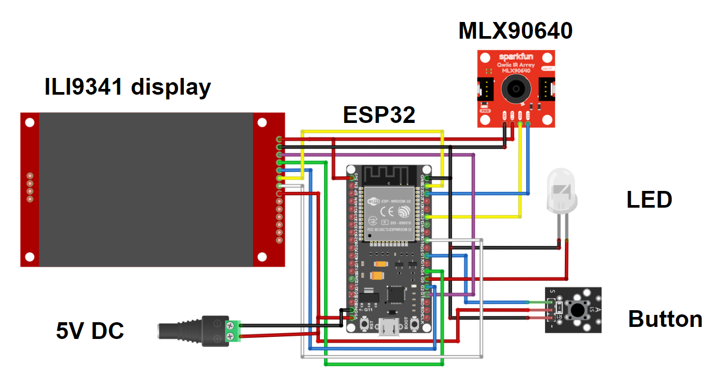
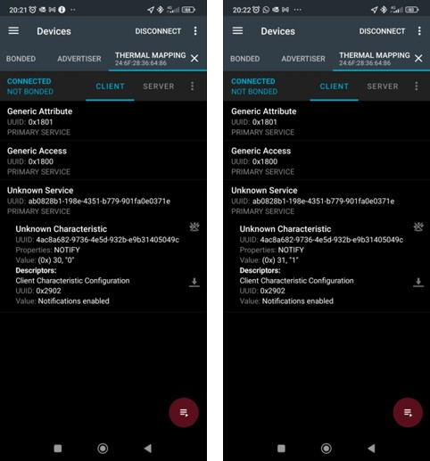
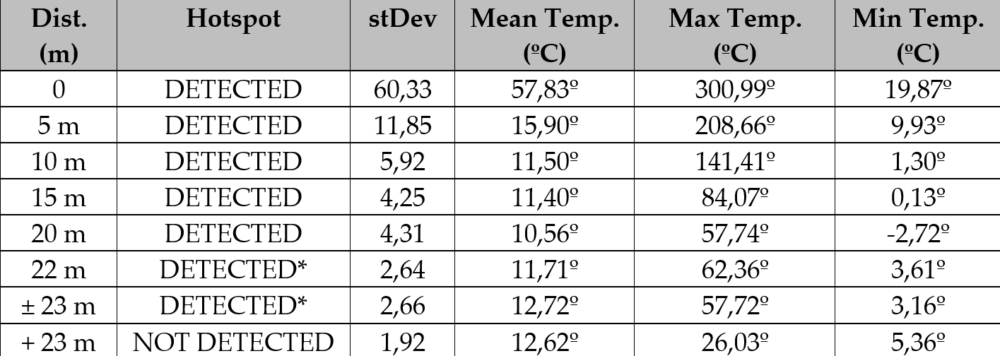

# Thermal Mapping Module
An ESP32-based device that detect hotspots using data from an IR sensor that could lead to new wildfire outbreaks. 

### Components
* ESP32 board
* ILI9341 2.8" TFT display
* MLX90640 31x24 IR sensor
* LED
* Pushbutton
* 5V jack

### Design of the Thermal Mapping Module
The Thermal Mapping Module (TMM) is used to detect hotspots or smouldering fires. This device leverages an MLX90640 thermal IR array sensor whose data is processed by an ESP32 development board (which shows it on an ILI9341 2.8” TFT display to facilitate interpretation by the device operator). Its data is transmitted via Bluetooth Low Energy (BLE) to a client application running on a smartphone. The use of this communication protocol allows the smartphone to be connected simultaneously to the TMM and the internet, thus facilitating the transmission of its data to a server where it can be accessed by other peers. 



### Detection of hotspots
The detection of hotspots makes use of the Normal distribution, more specifically of its empirical rule that says that approximately 99.7% of the values in a normally distributed dataset lie within 3 standard deviations of the mean - meaning within the range of -3 times the standard deviation to +3 times the standard deviation. This implies that most observations in a Normal distribution are clustered around the mean, with fewer occurring as we move away from it. Temperature values outside this range are considered outliers. To implement it, the average temperature is first calculated and then the standard deviation. When there is no hotspot, the values obtained do not vary much from the average, so the standard deviation is low. If the standard deviation is very high, this means that the values are quite dispersed and far from the average, which allows us to conclude that there is a hotspot. The result is a value of ‘1’ if a hotspot is detected, or ‘0’ if it is not detected.




### Results
The evaluation process had 2 phases: (1) determining the distance at which a more realistic flame would be reliably detected (and how an environment with high thermal "noise" would affect the TMM performance); (2) assessing the reliability of the hotspot detection algorithm. The first phase of tests was all performed using wood as fuel. Considering how the temperature of a wood-fueled flame far surpasses the maximum temperature the IR sensor can register, and that the fires used in field tests would be significantly larger, the tests were done at distances between 20 and 50 meters. For additional data points, some tests at 20 meters were made from a point around 5 meters below the flames and with a somewhat obstructed view. Below are some images from the 2 test phases.


The results of the 2 phases pf the evaluation process are summarized below. *(\*minimum standard deviation reduced to 2.5)*.




### Future work recommended
* New firmware implementation with optimizations such as: (1) The ESP32 has a dual-core processor but only core 1 is used (with core 0 being occasionally used to read the button and transmit data via BLE). Reformulating the firmware so that the interaction with the ILI9341 display takes place on core 0 could theoretically increase the refresh rate from 16 Hz
* Consider using a sensor other than the MLX90640
* Consider using a microcontroller other than ESP32
* Improve the connection of components would remove errors caused by connection interruptions


### Feel free to find out more detailed information about this project in the ```/TMM.pdf``` file within this repository.